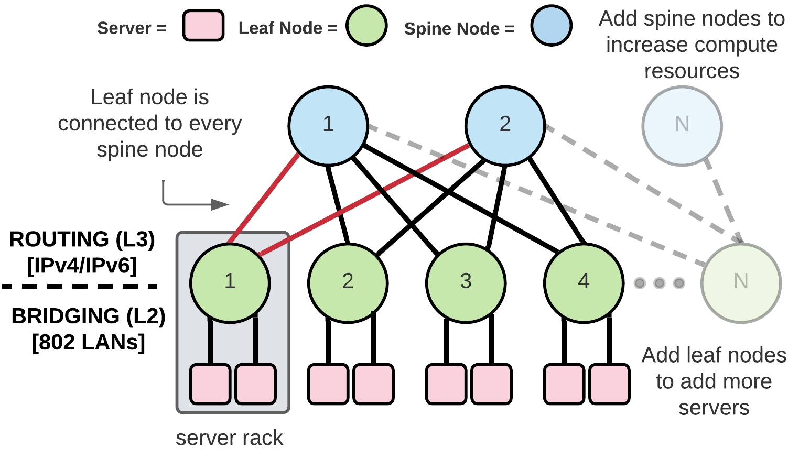
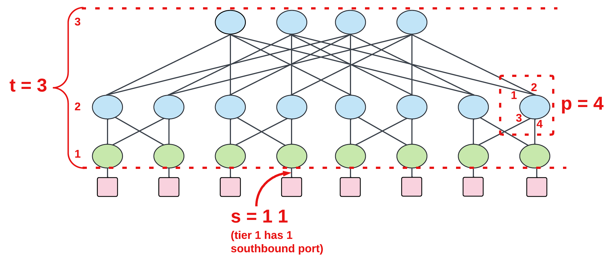

# Closnet

A framework to build an emulated version of a modern data center network for experimentation of network protocols. It is built as an extension of Mininet, a popular network emulator.

The topology built is a traditional folded-Clos with a 1:1 oversubscription ratio, resulting in a rearrangably nonblocking network (hence the name Closnet). Closnet is able to determine the appropriate configuration necessary for connecting nodes, which can then be used to build configuration files for network protocols that utilize the hierarchical folded-Clos system. The figure below illustrates a high-level overview of a folded-Clos data center nework:



## Getting Started

### Prerequisites

Closnet has been tested on Ubuntu 22.04 and the installation script currentlly assumes that it is being run on a Debian-based system that can access the apt package manager.

Due to the libraries used and its reliance on Linux network namespaces, Closnet can only be run on Linux distributions. Future updates may allow for other Linux distributions beyond Debian and its derivatives.

### Installation

All necessary software is installed using the included installation script.

```bash
git clone https://github.com/pjw7904/closnet.git
cd closnet
sudo bash install.sh
```

Packages installed include:
* Python 3.X
* Mininet
* Free Range Routing (FRR)
* tshark
* NetworkX (Python package)
* Mako (Python package)
* An implementation of the Meshed Tree Protocol for data center networks (MTP-DCN)

A number of these packages install their own dependencies that are not necessary for running Closnet and are running idle in the background. To "clean up" your system after installation, or after a reboot, please run the prep script.

```bash
cd closnet
bash prep.sh
```

## Usage

Running Closnet requires information about the folded-Clos topology to be built and what protocol should be installed on the nodes. There are two ways of starting and using Closnet: **interactive mode** and **experiment mode**.

### Running in Interactive Mode

Interactive mode allows you to play with your protocol of choice in your defined folded-Clos topology. The Mininet console is provided in this mode, hence the name interactive mode. Nothing is saved by default, it is a means of observing network behaviors at your pace.

The command to start Closnet in interactive mode is as follows, where [protocol] and [options] are arguments to be added depending on the experiment to be run:

```bash
sudo python3 -m closnet [protocol] [options]
```

[protocol] is the control protocol to be installed on the folded-Clos topology. The available protocols are described in the [protocol section](#protocols). This is a positional argument and must be the first argument as a result, prior to the other options.

#### Options

The folded-Clos topology configuration is describe in the options arguments.

| Option      | Description |
| ----------- | ----------- |
| `-h` or `--help` | Display all argument options and their purpose.
| `-t numOfTiers` or `--tiers numOfTiers` | The number of tiers in the folded-Clos topology, excluding the compute tier 0. |
| `-p numOfPorts` or `--ports numOfPorts` | The number of ports each switch has in the folded-Clos topology.|
| `-s tier numOfSouthboundPorts` or `--southbound tier numOfSouthboundPorts` | The number of links to a tier below by specficing the tier and the number of southbound ports per switch. |
| `--visualize` | A figure of the topology is generated and presented. A network is not started with this option.
| `--bfd` | Start the Bidirectional Forwarding Detection (BFD) protocol on BGP switches. This is ignored for MTP switches. |

### Running in Experiment Mode

Experiment mode is an automated framework to test network reconvergence upon the failure of a network interface. The protocol and folded-Clos topology specifications are defined like in interactive mode, but the process of running the experiment and then collecting as well as analyzing results is automated. The Mininet is torn down once the experiment is over, it does not revert to interactive mode.

Running Closnet in experiment mode is done through a JSON experiment setup file and then pointing to that file via the file CLI option.

```bash
sudo python3 -m closnet --file [experiment JSON file path]
```

#### Options

The file containing topology specifications and experiment details is recongized via the file option.

| Option      | Description |
| ----------- | ----------- |
| `-f experimentFile` or `--file experimentFile` | The file path to the experiment JSON file |

#### Experiment Configuration File

| JSON Key      | Type | Description |
| ----------- | ------   | ----------- |
| `protocol`  | string   | The protocol to install on the topology |
| `tiers`     | integer  | The number of tiers in the folded-Clos topology, excluding the compute tier 0. |
| `ports`     | integer  | The number of ports each switch has in the folded-Clos topology. |
| `southbound`| 2D array | The number of links to a tier below by specficing the tier and the number of southbound ports per switch. Each tier configuration is its own array within the array (see example) |
| `node_to_fail`| string  | The node that will have an interface failed. |
| `neighbor_of_failing_node`| string  | The node connected to the node to fail. This determines which interface must be failed on the node. |
| `log_dir_path`| string  | The path to the JSON experiment file |
| `debugging` | boolean | When analyzing the experiment data, additional output is added to the results file to show how each metric result is determined node-by-node. |
| `bfd` | boolean | Start the Bidirectional Forwarding Detection (BFD) protocol for BGP switches. |
| `traffic` | 2D array | Test traffic sent and received by clients using a custom traffic generator. The first node in the array is the sender and the second one is the receiver. 

For example, consider a link in your topology that looks like this:

**L1[L1-eth2]-------[T1-eth1]T1**

where L1 and T1 are nodes in the topology, and [L1-eth2] and [T1-eth1] are the names of the interfaces connected to their respective node. If you wish to fail interface L1-eth2, you would set `node_to_fail` as L1 and `neighbor_of_failing_node` to T1. Interface numbering is random, so this system allows for consistency in what interface is broken, regardless of the name of that interface.

#### Framework
Three metrics (and one optional one) are used to analyze the behavior of the protocols installed on the folded-Clos topology:

| Metric      | Description |
| ----------- | ----------- |
| Convergence Time | The amount of time it took for nodes to reconvergence upon the failure of the interface. *(How long recovery took)* |
| Blast Radius | The number of nodes in the topology that received a message updating them about the changes in the topology. A node is counted in the blast radius regardless if a change is made to the node's state, as it was required to parse the message to make that determination. *(How many nodes were notified of a change)*|
| Overhead | The total number of bytes that make up all protocol update messages that were sent/received. *(How much data was required to notify nodes)* | 
| Traffic | [OPTIONAL] Given 1000 test packets sent during the experiment, how many arrived sucessfully and how many arrived either out of order, duplicated, or were dropped? *(How client traffic was impacted by the failure and recovery process)* | 

A experiment follows the following steps:

1. Define the topology and the interface that must be broken.

2. Start the topology and give it a preset number of seconds (number of tiers * 4) to allow for the control protocol to convergence.

3. Record an experiment start time and start client traffic generation if desired.

4. Disable the specified interface (ifdown command) and validate it is down.

5. Pause for the same amount of time defined in step 2 and allow the protocol to detect the failure as well as reconverge the topology.

5. Record an experiment stop time.

6. Tear down the topology.

7. Collect the protocol log from each node and traffic log (pcapng) from the receiving client.

8. Analyze the collected logs to determine results.

9. Write results and experiment info to their respective log files.

Each experiment is recorded in a directory with the same name as the topology (protocol + Clos description) along with an Epoch timestamp with the experiment start time. The directory will contain a `nodes` subdirectory that contains all of the protocol log files from the switches. If traffic generation occurred, a `traffic` subdirectory with the pcapng of received traffic will also be present. Furthermore, the directory will contain an `experiment.log` file that describes when the experiment started and stopped as well as what interface was broken, and a `results.log` file that contains results for the three or four metrics. Debugging data will be in the results file if specified as well.

### Protocols

By default, Closnet includes two data center protocols to test.

| Protocol    | Description |
| ----------- | ----------- |
| mtp | A custom implementation of the [Meshed Tree Protocol for data center networks (MTP-DCN)](https://github.com/pjw7904/CMTP)|
| bgp | The Free Range Routing (FRR) implementation of the [Border Gateway Protocol (BGP)](https://docs.frrouting.org/en/latest/bgp.html) |

Included with these protocols are appropriate Mako template files to assist in automating the creation of configuration files for each node in the folded-Clos topology.

If additional protocols are desired, you must add the necessary information to a new `closnet/protocols` sub-directory, including a Mininet switch/node sub-class along with a Mako configuration template and the binary file if necessary. Finally, the new protocol must be recognized in the main function. Both the mtp and bgp sub-directories provide examples of how to add a protocol to Closnet.

### Example Topology Configuration

Given the following Closnet command (interactive mode):

```bash
sudo python3 -m closnet mtp -t 3 -p 4 -s 1 1
```

Or, the equivalent JSON experiment file (experiment mode) with traffic being sent from C11 to C41:

```json
{
    "protocol": "mtp",
    "bfd": false,
    "tiers": 3,
    "ports": 4,
    "southbound": [[1, 1]],
    "node_to_fail": "L11",
    "neighbor_of_failing_node": "T1",
    "traffic": [["C11", "C41"]],
    "log_dir_path": "/home/user/closnet/logs",
    "debugging": true
}
```

```bash
sudo python3 -m closnet -f /path/to/json/file
```

The following topology is built with each node running MTP:



## Viewing Node Data

Once Mininet is up and running, the current state of any given node can be determined by looking into its log file or by accessing its interactive shell.

### MTP

Logs are stored in the `/tmp` directory, with the following log files available to view for any given node (L1 in this example):

```bash
user@system:/tmp$ ls | grep L1
L1.conf
L1.log
L1.stdout
L1.down
```
| File      | Description |
| ----------- | ----------- |
| `.conf` | The MTP configuration file for the node. |
| `.log` | The MTP log file for the node describing protocol actions and updates. |
| `.stdout` | Any text which is meant to be printed to standard out or standard err is sent here. |
| `.down` | Created after the node is shutdown at the end of the test, the epoch time of shutdown. |

### BGP

Logs are stored in the `/tmp` directory, with the following log files available to view for any given node (L1 in this example):

```bash
user@system:/tmp$ ls | grep L1
L1.bfdd.pid
L1.bgpd.pid
L1.conf
L1.log
L1.zebra.pid
```

| File      | Description |
| ----------- | ----------- |
| `.bgpd.pid` | PID file for bgpd, do not touch. |
| `.zebra.pid` | PID file for zebra, do not touch. |
| `.bfdd.pid` | PID file for BFD, do not touch (optional protocol). |
| `.conf` | The FRR configuration file for the node. It contains BGP configuration. |
| `.log` | The FRR log file for the node describing BGP and Zebra actions and updates. |

FRR has an interactive shell (vtysh) to view and set configurations. You may access this shell for any given FRR node in a Closnet topology by opening a new tab and entering the following command:

```bash
vtysh -N [node_name]
```

Where [node_name] is the name of a Closnet node generated.

## Troubleshooting

The biggest issue with Mininet-based projects is having a topology fail and Mininet refusing to work after the fact. If this is the case, reset Mininet and your systems network namespace configuration with the command:

```bash
sudo mn --clean
```

If you would like to make changes to the MTP source code, you can recompile it easily with the provided script.
```bash
# Located in Closnet root directory
sudo bash compile_mtp.sh
```